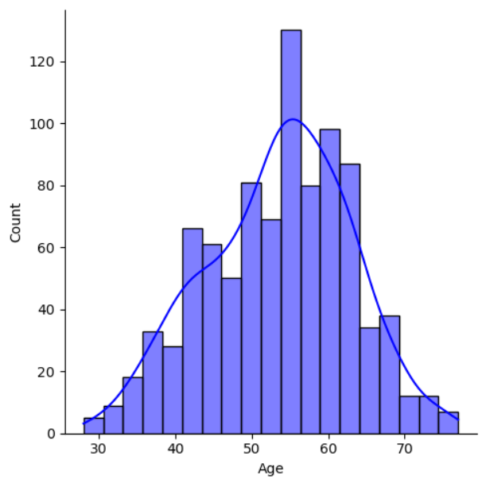
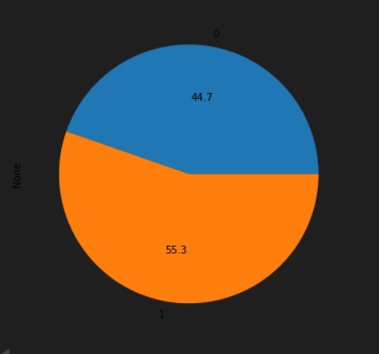
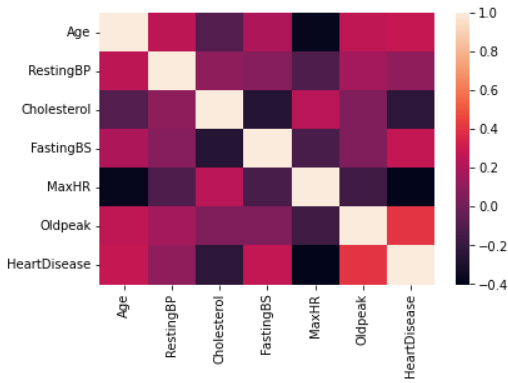
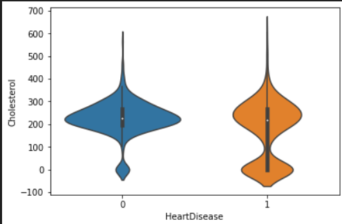
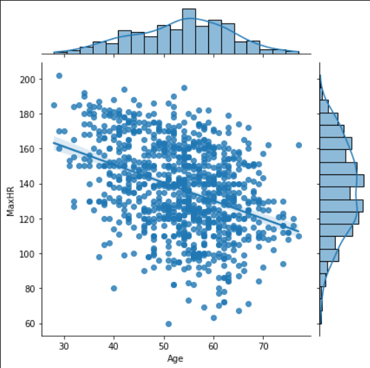

# Heart Disease Data Visualization

This project focuses on exploratory data analysis and visualization of a heart disease dataset using Python. The goal is to understand patterns, relationships, and trends in patient health data that may be associated with heart disease.

The analysis uses visualizations such as distribution plots, pie charts, violin plots, heatmaps, pairplots, and jointplots to explore important health-related features.

---

## Project Overview

Heart disease is one of the major health concerns worldwide. Analyzing patient health data can help identify important patterns and relationships between medical attributes and heart disease presence.

This project performs exploratory data analysis on a heart disease dataset to understand how features such as age, cholesterol, chest pain type, maximum heart rate, fasting blood sugar, exercise angina, and ST slope relate to heart disease.

---

## Problem Statement

Medical datasets often contain many numerical and categorical features that are difficult to interpret directly.

The objective of this project is to use data visualization techniques to explore the heart disease dataset and identify meaningful patterns that can support better understanding of heart disease-related factors.

---

## Objectives

- Load and understand the heart disease dataset
- Explore numerical and categorical features
- Analyze the distribution of patient age
- Visualize categorical variables using pie charts
- Compare feature distributions using violin plots
- Study relationships between numerical variables
- Analyze correlations using a heatmap
- Use pairplots and jointplots to understand feature relationships
- Summarize key insights from the dataset

---

## Dataset

The dataset used in this project is:

```text
heart.csv
```

The dataset contains patient health records related to heart disease analysis.

### Dataset Summary

| Item | Details |
|---|---|
| File Name | `heart.csv` |
| Rows | 918 |
| Columns | 12 |
| Project Type | Exploratory Data Analysis and Data Visualization |

---

## Dataset Columns

| Column | Description |
|---|---|
| Age | Age of the patient |
| Sex | Gender of the patient |
| ChestPainType | Type of chest pain experienced |
| RestingBP | Resting blood pressure |
| Cholesterol | Serum cholesterol level |
| FastingBS | Fasting blood sugar status |
| RestingECG | Resting electrocardiogram result |
| MaxHR | Maximum heart rate achieved |
| ExerciseAngina | Exercise-induced angina |
| Oldpeak | ST depression induced by exercise |
| ST_Slope | Slope of the peak exercise ST segment |
| HeartDisease | Target variable indicating presence or absence of heart disease |

---

## Visualizations Used

The project includes the following visualization techniques:

- Distribution plot
- Pie charts
- Violin plots
- Correlation heatmap
- Pairplot
- Jointplot

---

## Key Visualizations

### Age Distribution

This plot shows the distribution of patient ages in the dataset.



### Heart Disease Distribution

This chart shows the distribution of patients with and without heart disease.



### Correlation Heatmap

This heatmap shows the correlation between numerical features in the dataset.



### Cholesterol vs Heart Disease

This visualization compares cholesterol values based on heart disease status.



### Age vs Max Heart Rate

This jointplot shows the relationship between patient age and maximum heart rate achieved.



---

## Tools and Libraries Used

- Python
- Jupyter Notebook
- Pandas
- NumPy
- Matplotlib
- Seaborn

---

## Project Structure

```text
Heart-Disease-Data-Visualization/
│
├── README.md
├── requirements.txt
├── .gitignore
│
├── data/
│   ├── README.md
│   └── heart.csv
│
├── notebook/
│   ├── README.md
│   └── Heart_Disease_Analysis.ipynb
│
├── reports/
│   ├── README.md
│   └── Heart_Disease_Analysis_Report.pdf
│
├── presentation/
│   ├── README.md
│   └── Heart_Disease_Analysis_PPT.pptx
│
├── certificate/
│   ├── README.md
│   └── GeeksforGeeks_ML_and_DS_Certificate.pdf
│
└── images/
    ├── README.md
    ├── age_distribution.png
    ├── heart_disease_distribution.png
    ├── correlation_heatmap.png
    ├── cholesterol_vs_heart_disease.png
    └── age_vs_maxhr_jointplot.png
```

---

## How to Run Locally

### 1. Clone the repository

```bash
git clone https://github.com/Althafk7171/Heart-Disease-Data-Visualization.git
cd Heart-Disease-Data-Visualization
```

### 2. Install required libraries

```bash
pip install -r requirements.txt
```

### 3. Open Jupyter Notebook

```bash
jupyter notebook
```

### 4. Run the notebook

Open the notebook file:

```text
notebook/Heart_Disease_Analysis.ipynb
```

Run all cells to reproduce the analysis and visualizations.

---

## Key Insights

- Age distribution helps understand the age group most represented in the dataset.
- Categorical charts help compare patient groups based on sex, chest pain type, ECG results, ST slope, and heart disease status.
- Violin plots help compare feature distributions across different categories.
- Correlation heatmap helps identify relationships between numerical health indicators.
- Jointplots help analyze relationships between variables such as age, cholesterol, and maximum heart rate.
- Visualization makes it easier to understand patterns in heart disease-related data.

---

## Reports and Presentation

This repository includes:

- Jupyter Notebook with full analysis
- Dataset used for analysis
- Project report
- Project presentation
- Course certificate
- Visualization images

---

## Limitations

- This project focuses on exploratory data analysis and visualization only.
- No machine learning prediction model is deployed.
- The analysis is based only on the provided dataset.
- Medical conclusions should not be made without expert validation.
- The dataset may not represent all populations or real-world clinical scenarios.

---

## Future Scope

- Add machine learning models for heart disease prediction
- Compare classification algorithms
- Add model evaluation metrics such as accuracy, precision, recall, F1-score, and ROC-AUC
- Build an interactive dashboard using Power BI or Tableau
- Deploy a prediction web app using Streamlit
- Add more advanced statistical analysis
- Use larger and more diverse healthcare datasets

---

## Contributor

- Muhammed Althaf K

---

## License

This project is developed for academic and learning purposes.

---
